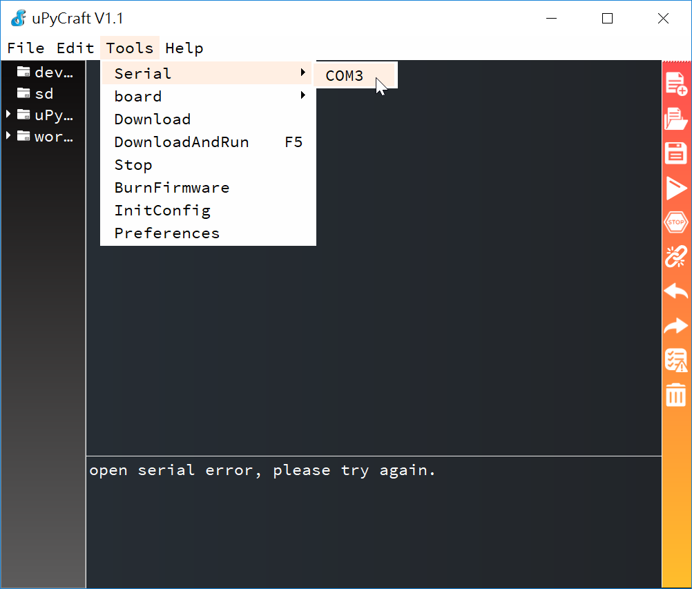
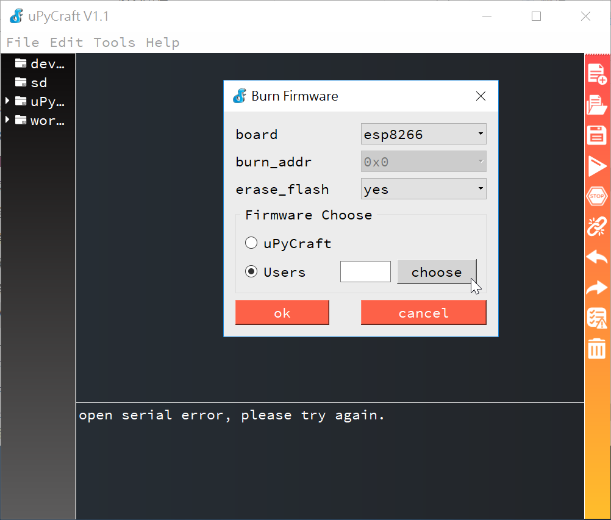
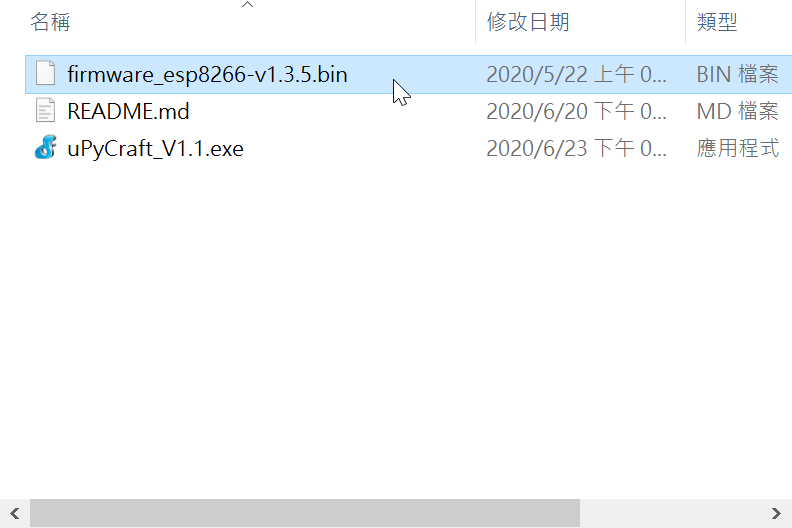
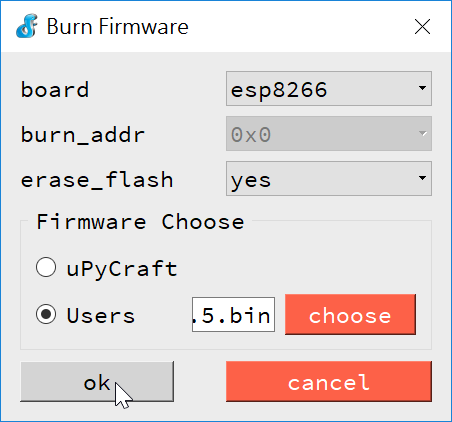
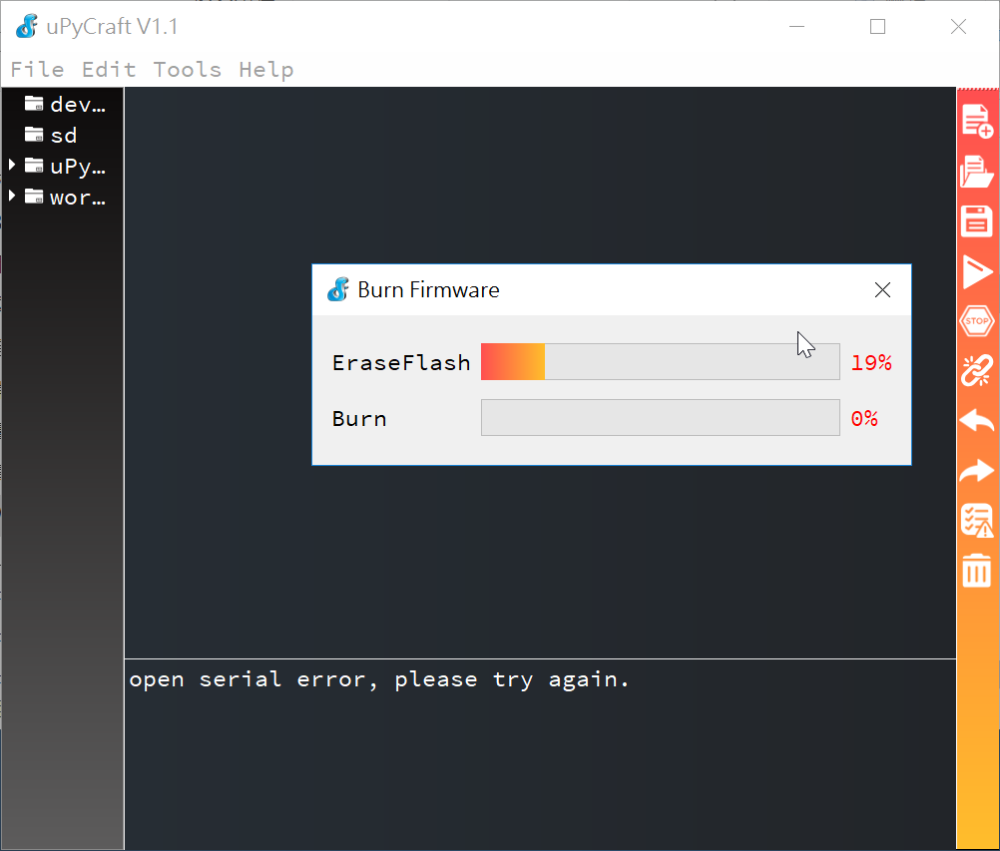

# 準備工作
0. 介紹ESP8266:


| 板子腳位	| ESP8266 腳位	| 功能   |
|---       |---          |---     |
|D0       	| GPIO16	     | IO     |
| D1      	| GPIO5	      |IO, SCL |
| D2      	| GPIO4	      |IO, SDA |
| D3	      | GPIO0	      | IO, 內建 10K 上拉電阻|
|D4	| GPIO2	| IO, 內建 10K 上拉電阻與 LED|
| D5	| GPIO14	| IO, SCK|
| D6	| GPIO12	| IO, MISO|
| D7	| GPIO13	| IO, MOSI|
| D8	| GPIO15	| IO, SS, 內建 10K 上拉電阻|
| TX	| TXD	| UART 送端|
| RX	| RXD	| UART 收端|
| A0	| ADC	| 類比輸入 (0~3.3V)|

1. 安裝 CP2102 驅動程式 : 
剛拆封的 NodeMCU 板子用 micro USB 線接上 PC 時, 開啟裝置管理員, 在連接埠 (COM 與 PRT) 項下會找不到 COM 埠. 必須下載安裝驅動程式 (CH340 在 Win10 就有, 毋須安裝).

CP2102 的下載位址 :
https://www.silabs.com/products/development-tools/software/usb-to-uart-bridge-vcp-drivers  

2. 打開 "uPyCraft_V1.1.exe"

3. 打開 Tools->Serial->COM3



4. 選擇 board: esp8266, Firemware Choose:Users



5. 選擇 "firmware_esp8266-v1.3.5.bin"



6. 按"OK"刷新  



7. 等待100% 更完成刷新



8. 將 mpfs.exe 與 boot.py 放在一起，按以下命令操作。
```
mpfs [/]> open
looking for all port...
Connected to esp8266
mpfs [/]> put boot.py
mpfs [/]> repl
>
*** Exit REPL with Ctrl+Q ***

MicroPython v1.12 on 2020-02-23; ESP module with ESP8266
Type "help()" for more information.
>>>import webrepl_setup
```
出現是否要啟動 webrepl 功能的詢問選單, 選擇 Enable 的話還要設定連線密碼並重啟系統才會生效. 

9. 透過wifi 連接webrepl,
````
mpfs [/]> open ws:192.168.10.114
````