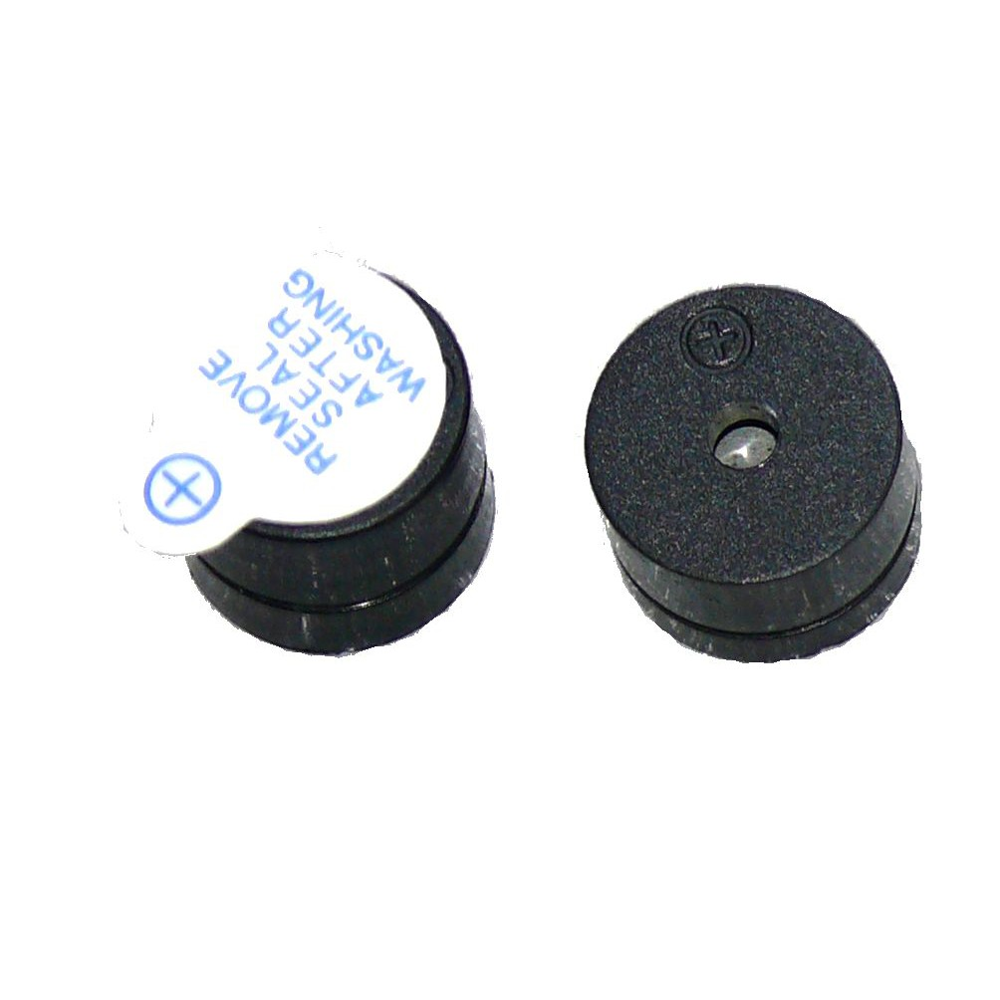

# 蜂鳴器


1. 接法

| Wemos D1-ESP8266 | buzzer |
| ---              | ---    |
|D2(GPIO4)         | +      |
|GND               | GND    |

2. 打開 mpfs.exe  
```
mpfs [/]> open ws:192.168.137.2,12345678
mpfs [/]> put music.py
mpfs [/]> runfile bee2.py