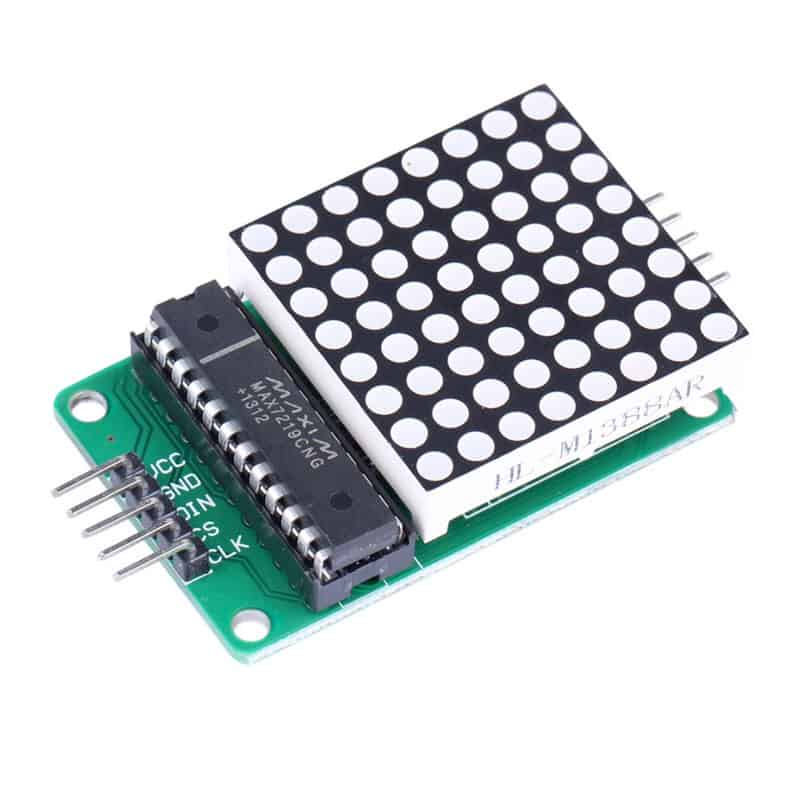

1.  硬件接法  



Wemos D1-ESP8266    | max7219 8x8 LED Matrix
---------------- | ----------------------
5V               | VCC
GND              | GND
D7 MOSI (GPIO13) | DIN
D8 CS (GPIO15)   | CS
D5 SCK (GPIO14)  | CLK

2. 打開 mpfs.exe  
```
mpfs [/]> open ws:192.168.137.2,12345678
mpfs [/]> put max7219.py
mpfs [/]> runfile ts.py
```